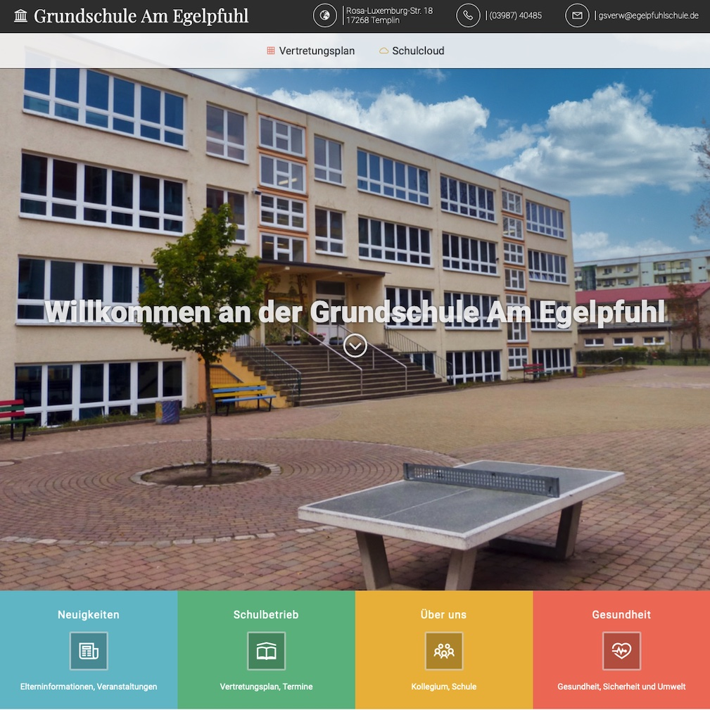

# Grav Theme "Grundschule Am Egelpfuhl Templin"

The **Gse** Theme is for [Grav CMS](http://github.com/getgrav/grav). 

## Description

This is the Grav theme for the homepage of the primary school "Am Egelpfuhl" in Templin/Germany

The theme was created from scratch (inspired by a few pictures I found on the internet) - technically it is probably in need of a lot of improvement.
To use the theme, a special folder structure in Grav is required, which is only sparsely documented here.

A few parameters can be configured via Grav's admin interface - maybe I'll find the time to describe it here sometime.

